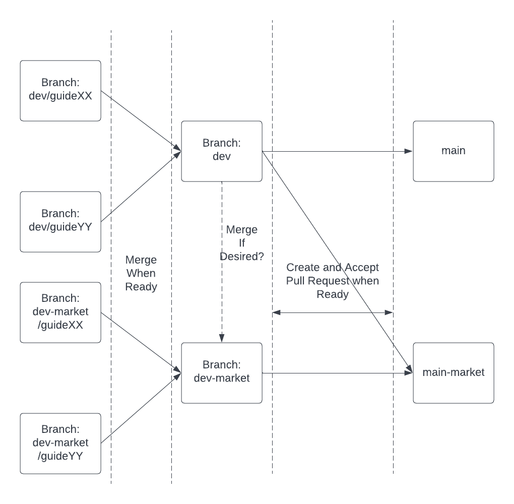

# Documentation
Documentation for the Stardust Platform and for integration with the Readme Platform Documentation as well.

## Folder structure:
- Guides
	- Guide1.md
	- Guide2.md
	- etc
- Ref
	- StardustCore.json
	- StardustMarketplace.json
- images
	- Guide1
		- Image1
		- Image2
	- Guide2
		- Image1
		- Image2
- Everything else

## Branches:
- main -Just stardust core APIs and core Guides
- main-market - everything in main + marketplace Guides
- dev - Just stardust core Guides that are in development
- dev-market - dev marketplace Guides (feel free to merge dev in if ever need be?)
- dev/guideXX
- dev-market/guideXX
- Once marketplace is out of beta then maybe main-market -> main?

## Github Actions:
- on:push:dev will update dev Readme Docs version v0.0.0
- on:push:dev-market will update same dev Readme Docs version (v0.0.0)
- on:pull-request-accepted:main will update Readme Docs v1.0.X
- on:pull-request-accepted:main-market will update Readme Docs v1.1.X (Beta)
- Need to make two pull requests to main and main-market from 

