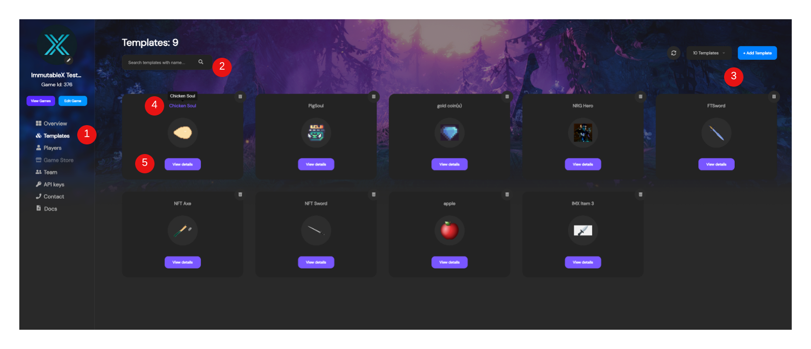
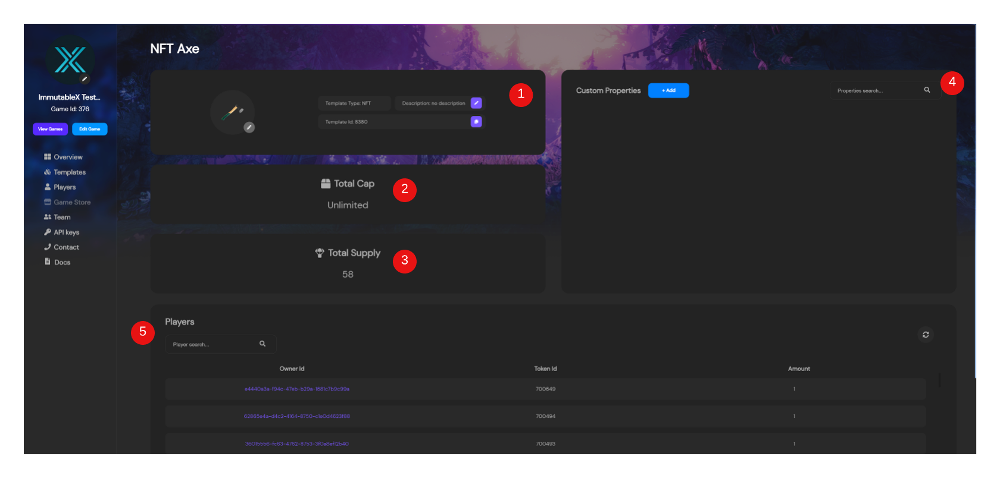

---

title: Using Token Templates
excerpt: Basics of how to use the Admin Dashboard to understand your token templates
category: ADMIN_DASHBOARD_ID
slug: using-token-templates
order: 2

---

In this guide we're going to go over token templates, and managing them in the Stardust dashboard. To explain, token templates are used to define a standard for what a token should look like at the time of minting, and what information that all token instances should have.

> 📘	Unique Token Attributes
> 
> While templates are great for producing identical versions of a token time and time again, you may want a given instance to have attributes unlike it's fellow instances. These attributes can be assigned at the time of minting using the /token/mint API endpoint.

### Templates Page

1. **Template Nav Item** - This is the nav element to always get you back to the templates view whenever you may be in the Stardust dashboard.
2. **Template Search** - While looking at the Templates Page, you may already know what Template you want inspect. Here you can search by the template name to quickly find what you're looking for.
3. **Add Template** - Adding templates via the dashboard is a great way to get started. Usually you'll already know what assets your game will have, so you can quickly do that here on this page with the `+ Add Template` button in the upper right hand corner.
4. **Quick Copy** - If you're just trying to quickly get the templateId for a given template, you can click the name of template on any template tile and it'll add the templateId to your clipboard.
5. **Template Details** - On any template you can click the `View Details` button to be taken to the Template Details page to learn more about the template.

### Template Details Page

1. **Template Info** - These is where you can find the basic descriptor information about your template. If needed, you can manually update the image associated with your template or the description.
2. **Total Cap** - When a template is first created, a total capacity of tokens it's allowed to generate must be defined. This cannot be updated once set so choose wisely!
3. **Totaly Supply** - This tells you what the count is of tokens currently circulating among players.
4. **Custom Properties** - Template custom properties are a way to add additional information that's specific to this token template. These properties could be things such as rarity level, damage, durability, etc. These properties will exist across ALL token instances of this template.
> 📘	Immutable Properties
> 
> If you'd like to set an immutable property, you can do so through the /template/create API endpoint. Once set though, it cannot be undone.

5. **Players** - This is list of all the players who currently hold a token instance of the template. Here you can see the exact id of the token held by the player, and the amount. If you'd like you can also click the player's id to be taken directly to the players details page of that exact player and see more about the player and what else they're holding.

> 📘	Where do I mint tokens?
> 
> When looking at the template pages or at a specific template for a token, you may be wondering _"OK, well how do I mint this token?"_ This is actually done on the players page. This is because you always have to specific a player to which you want to mint a token to.
