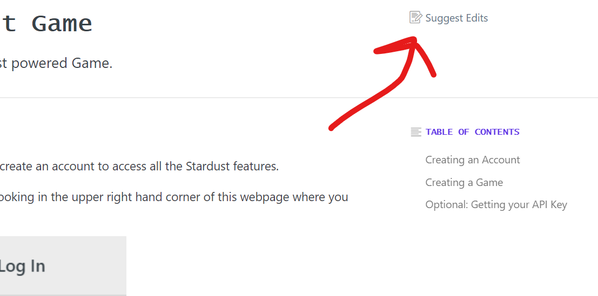
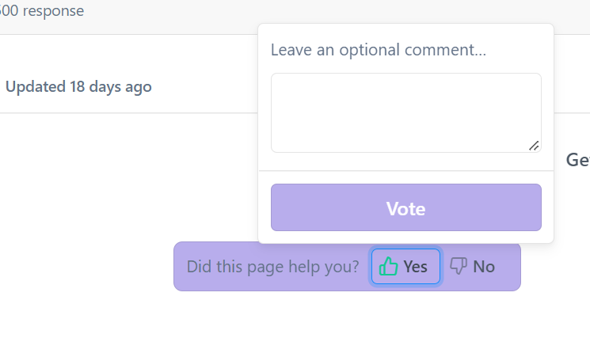

---

title: Giving Feedback & Getting Help
excerpt: Basic Quick Start to what to do if you can't find the necessary information in the docs.
category: QUICK_START_ID
slug: feedback-and-help
order: 6

---

## Giving Feedback
If you've had a good experience or bad experience, saw a typo, or something was unclear, then we'd really love your feedback

There's two ways to give Feedback:

1. Suggested Edits - For any of the guides you can open up suggested edits and edit the text live in your browser and then submit your edits for the team to look at
2. Page Likes - For both the guides and the API reference, you can leave a like or dislike along with a comment

Either option is acceptable to us here at Stardust. We'd appreciate as much detail as possible though to help us take our docs to the next level!

### Using Suggested Edits

To find where you suggest edits, make sure you're on a guides page, and then on the right hand side you should see a `Suggest Edits` button

This will open up a new page with the contents of the page as raw text. Find the text that you think could be better improved, go ahead and change it, and then hit the `Submit Suggested Edits`.

That way we'll get your suggestions and can review them to make improvements in the docs!

### Page Likes
At any point throughout the docs you can your feedback via the like and dislike buttons at the bottom of each page. So if you found a page useful, we'd really appreciate it if you could **smash that like button** and leave us a comment too !

 And if you didn't have an oh so great experience during this guide then leave a "thumbs down" and let us know what we did wrong!

## Getting Help
So while we try to make things as informative as possible, and structured such that it's easy to find, things still fall through the cracks. Use the following ways to get help when such a time comes

### Using the Search
If you read something that referenced something elsewhere, or came across something in the guides the seems superficial, then try to search functionality to locate the associated information. You can do so by pressing `CTRL` + `K`(on Windows or `CMD` + `K` for Macs) to open up the search window. This will allow you to search the entirety of the Stardust docs.

### Using the Discussions
If you're unlucky with finding what you're looking for using the search functionality, then head over to the [Discussions](https://docs.stardust.gg/discuss) and ask a question! A Stardust team member will try to get back to you as soon as possible.

