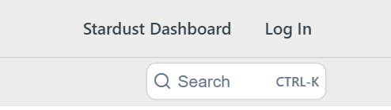
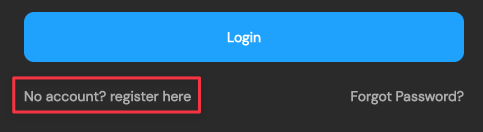
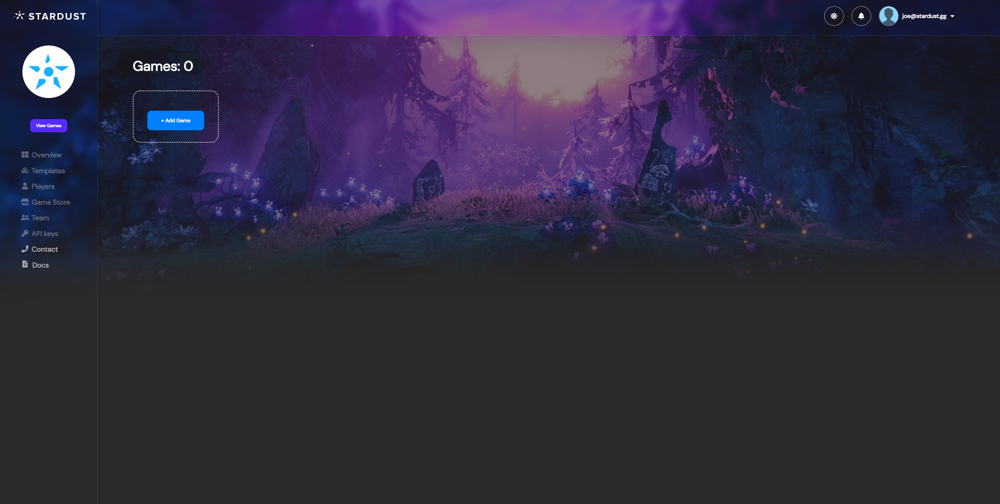
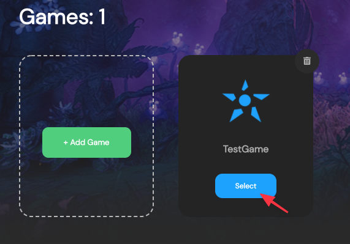
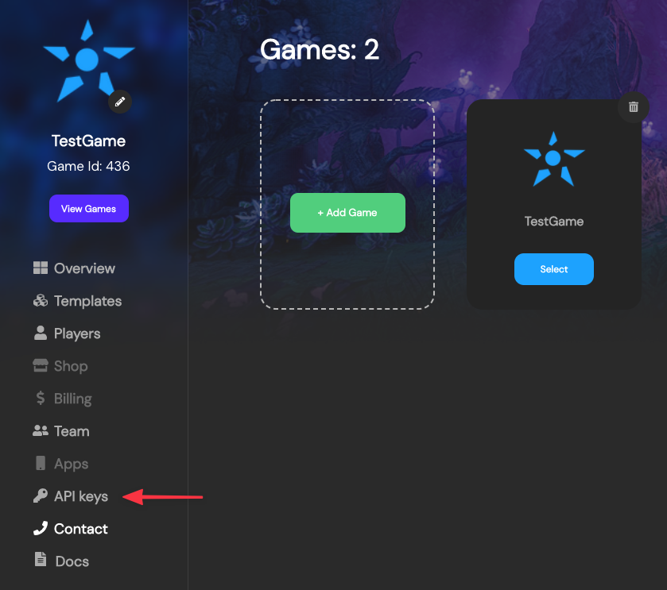
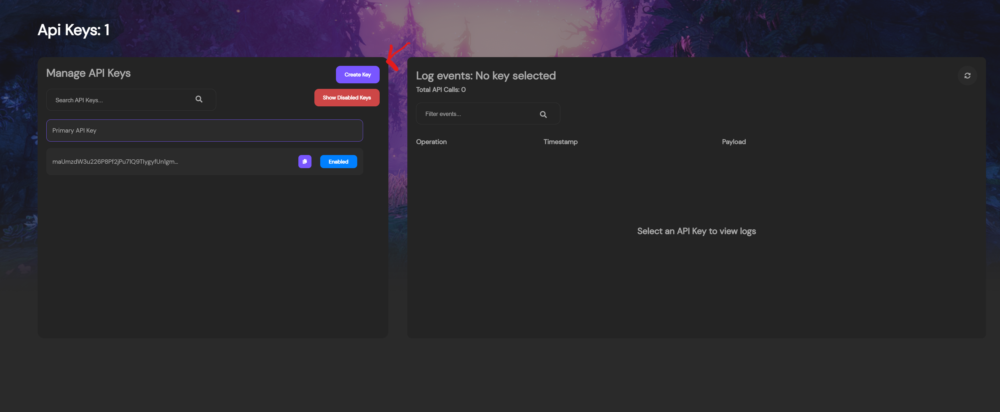

---

title: Creating Your First Game
excerpt: Basic Quick Start to make your first Stardust powered Game.
category: QUICK_START_ID
slug: creating-your-first-game
order: 1

---

## Creating an Account
To start, if you haven't already, we will need you to create an account to access all the Stardust features.

To do that, navigate to the stardust dashboard by looking in the upper right hand corner of this webpage where you should see a button called "Stardust Dashboard"

After clicking the link, you should be taken directly to the Dashboard login page.

Here you can create an account by clicking the field beneath the login button that says "No account? Register here" or Login with your preferred social account that is supported.

If you registered an account using your email, you should be redirected to an email confirmation page

Go ahead and check your email for the confirmation code that we sent to you. If you can't find it in your inbox then please check your spam or junk folder.

## Creating a Game
Once you've signed in, you should be redirect to a page that looks something like the one below. 

This is the games page. This is where you can see all your current games that are running on Stardust.

Go ahead and hit that "+ Add Game" button to go ahead and lay the foundation for our first game. On click, a form fill should pop up asking you to fill out the information about your game. 

The form will ask you for a name for your game, a description, a game Icon, and which blockchain you'd like to deploy on.

> 📘	Use a Game Icon
> 
> While you don't have to upload a game Icon to create a game on Stardust it definitely helps! Your game icon will be displayed on the left navigation bar to let you know which game you have set as the active game. Being able to see that icon will help to let you know for sure you're looking at the right game and making the correct edits!

Once you've selected the blockchain that you'd like to build on then go ahead and hit that "Confirm" button.

The dashboard should set the newly created game as the default, but if not, hit the "Select" button to make sure that it is the active game.

And just like that! You've created your first game on the blockchain! No gas fees, and no coding required! 

## Optional: Getting your API Key
On subsuquent pages of these quick start guide there will be options to do the next steps via the dashboard, or the API. If you'd like to go through the quick start process using then API then shift your attention to the navigation bar on the left hand side of the page. Near the bottom of the navigation options there is "API Keys." Go ahead and navigate there.

Now you're on the API page. This is where you can manage your API keys(left), and view the API logs(right) by the selected API Key.

Go ahead and shift your attention to the key management page and click on "Create Key"

With that done you've now successfully created your API key to use, and you're ready to begin using the Stardust API.

> 📘	Viewing API Calls and Logs
> 
> By default the number of calls and logs are associated with each API key. To view the number of api calls and the logs, select a key from the key management tile that you'd like to inspect.

 