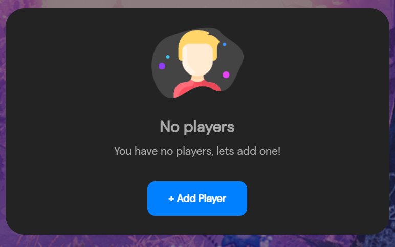
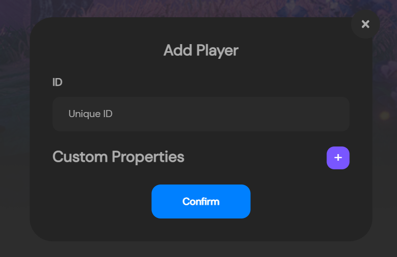
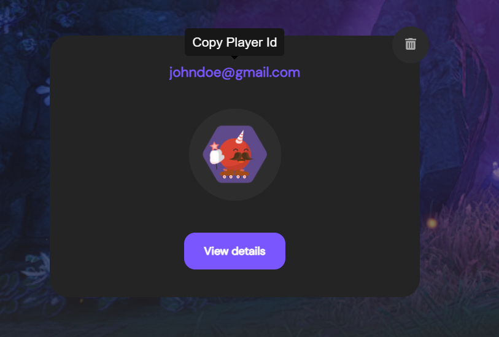
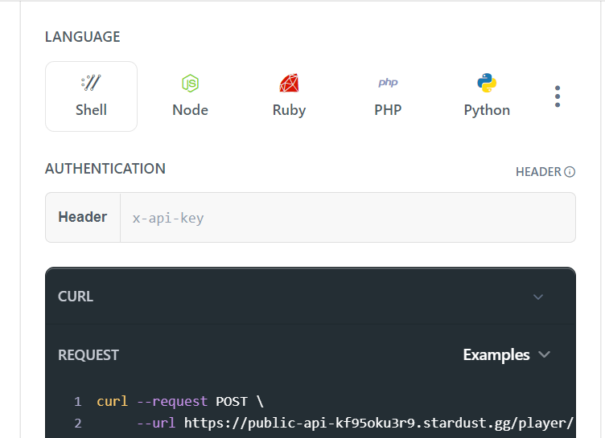
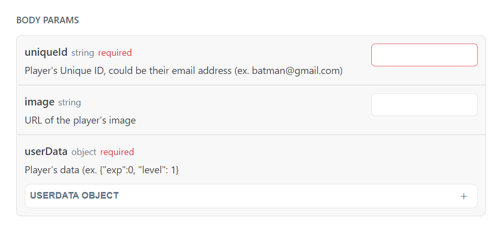
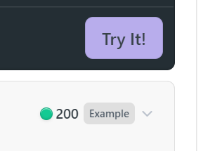

---

title: Adding your First Player
excerpt: Basic Quick Start on how to add your First Player to your Game.
category: QUICK_START_ID
slug: creating-your-first-player
order: 2

---

Player's exist in stardust to reduce the friction that comes with a person creating and managing a wallet for themselves, and the friction that users experience with using a self-custody wallet by being required to sign every transaction. So in this guide we're going to walk through creating a player

## Option 1: Using the Admin Dashboard
If you're following selecting to follow this guide via the Stardust API, please jump to [Option 2: Using the API](#using-the-api)

To start we need to navigate to the players page and select the `+ Add Player`.

Which will then prompt you to provide a Unique ID and any custom properties as well, like such:

The Unique ID can be literally anything you'd like it to be, but it's used to represent a player so try and pick something that makes the most sense. This can be the players email, or possibly their username in game, or maybe the the primary key you have in your database to identify the player.

Custom properties are any data you want to be associated with this player. Think maybe level, whether they're a premium member or not, maybe total hours played. Anytime that may need to be associated with the player and referenced when performing actions on the player or their inventory.

Once defined, hit `Confirm` and you'll have created your first player!

This will create a new player on the Players page like such:

Go ahead and click the Unique ID at the top, to copy the playerId to your clipboard which should look something like this: bef0bfb1-6bde-4299-81f8-113a01f3b118 as we'll ned that for the next step.

## Option 2: Using the API

Now if we're going to create a player via the API, feel free to use whatever API tool you'd like to use, or write your own script, but we're going to use the API Reference section to make our API calls. To make a player we're going to navigate to the [Create Player](https://docs.stardust.gg/v0.0.0/reference/post_player-create) page.

Here there's a couple of things we need to fill out to make a player via the API, pretty similar to using the dashboard but with a few changes.

First, we need to put our API key in the header field for authentication purposes.

Once we've added the API key to the top of the reference page, it'll stay cached, and we wont need to add it when navigating to other pages.

From there we need to add body parameters to the API call.

Go ahead and add in a uniqueId into the field, and then hit the `Try it!` button to submit the API request.

And if everything goes well, you should get a 200 response like the one below! 

Once we're all squared away on that, bring your attention to the **playerId** that was given in the response and write this one down. We'll be using it later on in this guide.