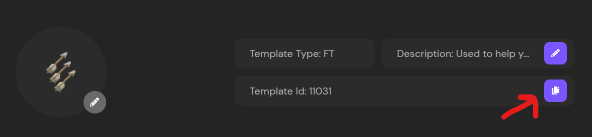
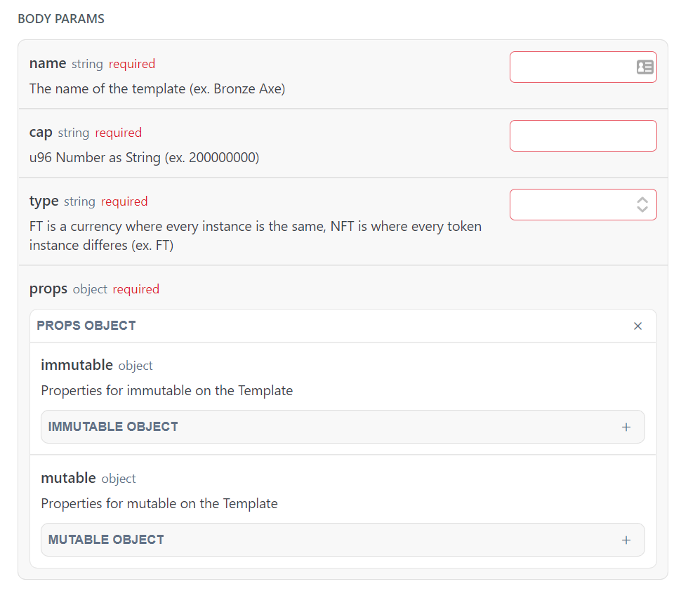
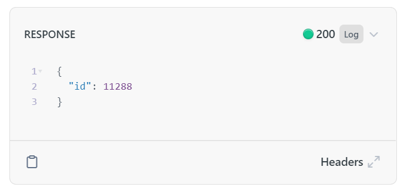

---

title: Creating a Token Template
excerpt: Basic Quick Start to making Token Templates.
category: QUICK_START_ID
slug: creating-token-templates
order: 3

---
Now that we've created a player, we want to mint them NFTs as a part of their effort for playing our game, but first we'll need to make a token template.

What's a Token Template?

Glad you asked.

A Token Templates exist to define a base layer upon which tokens share some sort of commonality. For fungible tokens, that base layer is the only layer as all fungible tokens must be identical. For non-fungible tokens, the token template allows for all tokens of a certain token template to have some degree of shared commonality, and then each token can have token specifics on top of it. 

For example, a gold coin would be a good example for a fungible token. 1 gold coin is identical in every way to another gold coin.

For an non-fungible token, armor could be a good example. Two pieces of armor could have identical stats, but 1 could be in better condition than the other. So they share the same base layer(stats), but they each hold specific traits to themselves(condition).

This is the importance of token templates, so let's go over making a token template now.

## Option 1: Using the Admin Dashboard
If you're following this guide series using the API, then please jump ahead to [Option 2: Using the API](#using-the-api)

To start, let's navigate to the templates page, and just like we did, let's hit the `+ Add Template` button.

Once selected, we should see a pop-up as such:

To quickly go over these form fills:
- **Name** - The name for all tokens created using this template
- **Description** - The description for your all tokens created using this template
- **Image** - The image for all tokens created with this template
- **Cap** - The total number of tokens that can ever be minted from this template
- **Type** - Fungible Token(FT), or Non-Fungible Token(NFT)
- **Custom Properties** - Any additional data you'd like to add as well such as durability, damage, or buff percentage. Once more, these properties will be added to all tokens created using this template

Once you've filled out everything, go ahead and click `Confirm`. Just like that, we've made our first token template!

> 📘	Unlimited Cap
> 
> When selecting `Unlimited` as a cap, the cap is not *actually* unlimited. Blockchains have a limited size to how much they can actually hold for a specific integer. For that reason, when you select `Unlimited` we just assign the largest possible value we can for that template, and assume you'll never reach it. If you're defining your token to have a very high decimal point, or expect to be moving and minting significantly large numbers, then you may have an issue.

For the next step, we'll need our template ID when minting a token to know which template to reference

For that, go ahead and click into the newly created template, and grab it's template ID

## Option 2: Using the API

Just like adding our first player, we're going to do the same using the API via the [API Reference](docs.stardust.gg/reference).

Navigate to the [Create Template](https://docs.stardust.gg/reference/post_template-create), and let's inspect the body parameters.

Go ahead and fill out all the required fields as you like.

> 📘	Immutable Properties
> 
> One noticeable difference between the dashboard and the API are the `Immutable` and `Mutable` objects. When creating a template via the dashboard, every custom property is set to mutable by default with no way to set a proper as immutable. If you'd like to set a property as immutable, such that it can never be changed, you can do so here.

Like before, go ahead and hit the `Try it!` button to submit your request.

Hopefully you should see a response like the one below:

Letting you know the ID of your template, which you can later reference in other API calls.
