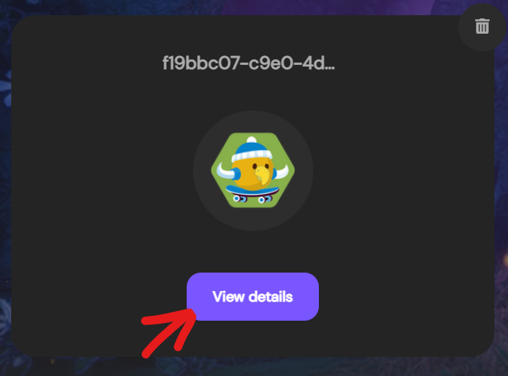
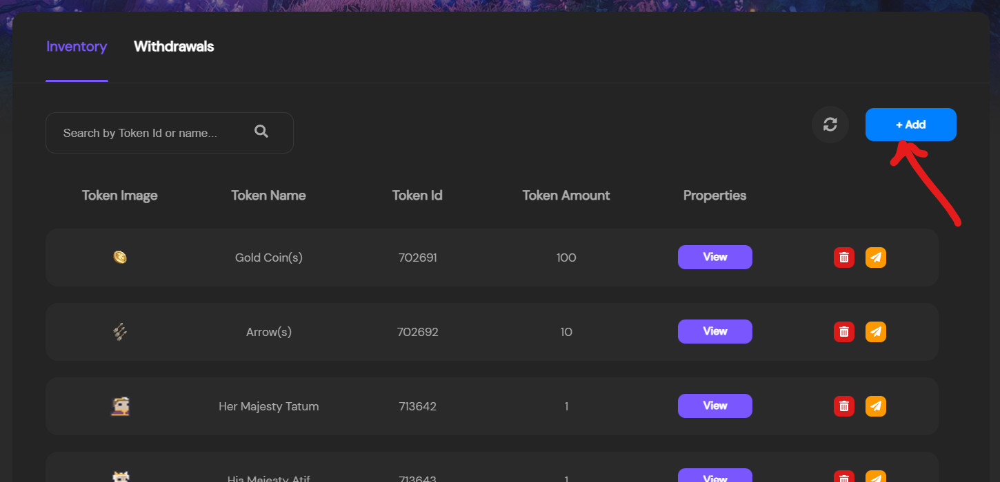
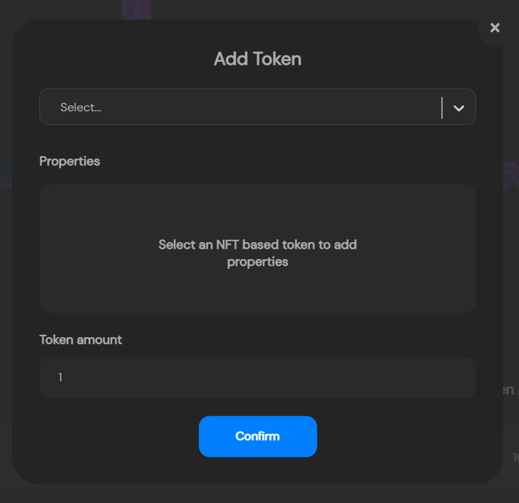
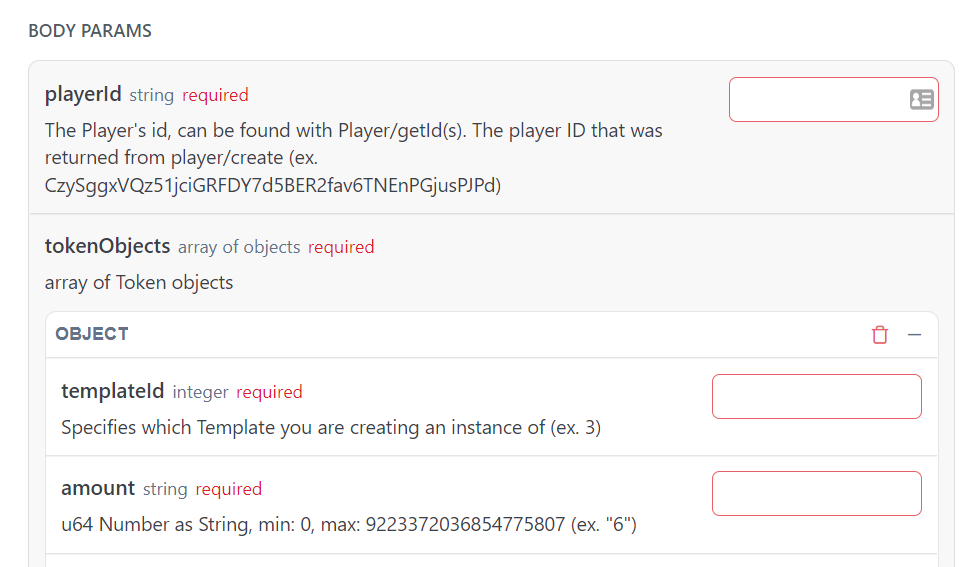

---

title: Minting a Token to Your Player
excerpt: Basic Quick Start to minting tokens to Players.
category: QUICK_START_ID
slug: minting-to-players
order: 4

---

Now that we've got a player and our token template, we're finally ready to mint our tokens to our players!

## Option 1: Using the Admin Dashboard
If you're following this guide with the intent of minting tokens via the API, then skip to [Option 2: Using the API](#using-the-api)

To mint tokens from the admin dashboard, there's actually no specific navigation item to go to specifically for minting. To mint, we're actually going to go the our Players.

Go ahead and select a player you want to mint a token to in the dashboard by hitting the `View Details` button

Then when looking at a specific player, we can scroll down to the bottom to see the players inventory.

Looking at the players inventory we can see the option to `+ Add` an item to their inventory. This is how we mint tokens via the Dashboard

So let's go ahead and hit the `+ Add` button and you'll see a prompt like such:

So go ahead and select the token you'd like to mint to a player from the dropdown.

Next you see the `Properties` section. This field is only activated if the selected token is an NFT. This is because the properties added here will be only be applied to the *single* token instance that we're about to mint, other instances will not have these properties. The reason why this is only active for NFTs is because if we added properties to a single token instance of an FT, then it would actually no longer be fungible according to what it means to be fungible.

Lastly, enter the amount of tokens you'd like to mint

Once filled out, go ahead and click `confirm` and if everything goes well, you've successfully minted a token to your player!

## Option 2: Using the API

For the last step we're going to mint a token to our player using the token template we just created.

Once more, we're going to use the API Reference section again using the [Mint Token](https://docs.stardust.gg/v0.0.0/reference/post_token-mint) page.

Looking at the body params we can see what all is required.

Go ahead and enter the player and template ids we got earlier in this guide, and enter the amount you'd like to mint.

Finally go ahead and hit `Try it!` to successfully mint your tokens!

> 📘	NFT Amount cap of 1
> 
> If you've selected an NFT template, you may get an error back from the API. This is because at the current moment, you can only mint 1 NFT at a time. But you can mint as many FTs as you like.