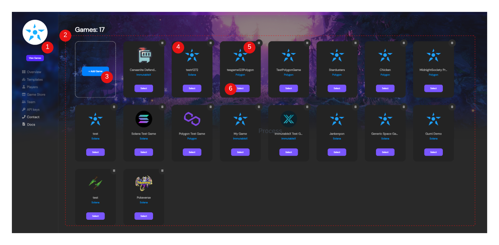
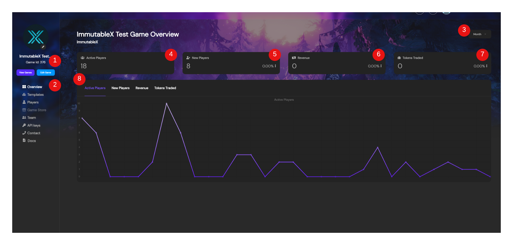

---

title: Game Management
excerpt: Basics of how to use the Admin Dashboard to make and manage a game
category: ADMIN_DASHBOARD_ID
slug: creating-a-game
order: 1

---

In this guide we're going to go over basic game management using the Stardust dashboard. We want to explain all the functionality built into the dashboard so that you're able to easily navigate around and understand what all you're able to make, change, update when it comes to managing your games

### The Games Page
When you log in, this is always the first page you see. This is because everything first starts with a game. Let's go over the game page and talk about what all is here:

**insert image**

1. **Game Nav** - On the entire left side of the page is the game navigation bar. Currently most everything is greyed out because we don't currently have a game selected. How do we know that? If you look at the white circle with the Stardust logo in it, that the Game's Portrait, and since we don't have anything selected we just see the white circle and the blue logo. When a game is selected, it'll update the portrait to display the icon associated with a game. In the event that you create a game without an icon, the blue logo will still but there but with a dark background instead letting us still know a game is selected.
2. **Games View** - The Games View is a view to see all the games associated with a user's Stardust account.
3. **Add Game** - When you want to create a game, you can click here at the `+Add Game` button to have the dashboard take you through the prompts of providing the information to create your next Stardust powered game.
4. **Game Tile** - The Game Tile Cards give you the basic information about your game with just it's icon, name, and what blockchain it's on, with the options to delete the game or get more details about it.
5. **Delete Game** - In the top right of every tile card is a little 🗑️ trash can icon that allows you to delete a game if you'd like after you've entered the name of your game.
6. **Game Details** - Lastly the `Select` button on each Game Tile allows you to make that the active game on the Stardust dashboard thus allowing you to get more details about the game and open up the navigation options we see greyed out.

### Game Overview Page
The game's overview page gives you a high level view of the activity of what's going on in your game. Let's dive in to see what all we can get from this view:

**insert image**

1. **Game Options** - First let's quickly note, Looking now in the upper left hand corner you can see the icon has change idicating we've selected a game, and let's us know what our Game ID is too. You can also see elements to edit the icon now if you like, or edit the game details with the `Edit Game` button. At any time you can return to the Games Page with the `View Games` button.
2. **Overview Navigation Item** - Seeing this highlighted lets us know we're on the Overview Page. We can click here as well to ever navigate back to the Overview Page.
3. **Overview View Selector** - This Selector allows us to determine what time duration we what to view specifically. We can select the past week, the past month, or the past quarter. Once selected the overview elements will update based on the selected view.
4. **Active Player Count** - This tells us the total count of how many specific players were atleast active once during the selected view.
5. **New Player Count** - This tells us the total count of new players who joined and created an account during the selected view.
6. **Revenue** - This tells much how much revenue has been generated based on sales and NFT royalties from peer to peer trades. It also shows us whether that activity has gone up or down and by what percent relative to the previous week, month, or quarter.(Feature currently a work in progress)
7. **Tokens Traded** - This tells the total volume of total trades over the selected view period. It also shows up, like Revenue, whether activity has gone up or down and by what percent relative to the previous week, month, or quarter.(Also currently in progress)
8. **Graphical View** - The graphical view always a user to see how any of the aforementioned metrics have played out over the selected view's period of time 