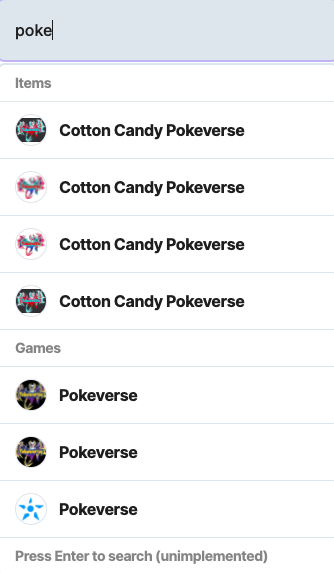

---

title: Creating a Homepage
excerpt: Basics of how to create your own Homepage
category: BUILDING_WITH_STARDUST_ID
parentDoc: MARKET_PARENT_ID
slug: making-a-homepage
order: 1

---

The first main page of your marketplace includes a few important functionalities
* Searching 
* Viewing Active Games
* Trending Items

# Searching
In this section, we'll show how to create a search bar for your marketplace

* Showing Templates (Item Types) and Games via text search can be done via the search endpoint here
https://stardust-marketplace.readme.io/reference/games-template-search

* Text searching for orders is not yet live! Please check back soon :)

# Viewing Active Games

* Extremely simple to do with the Stardust API! Utilize this endpoint here
> Not yet production ready, please check back soon!

# Trending Items
> Done Soon :tm:

