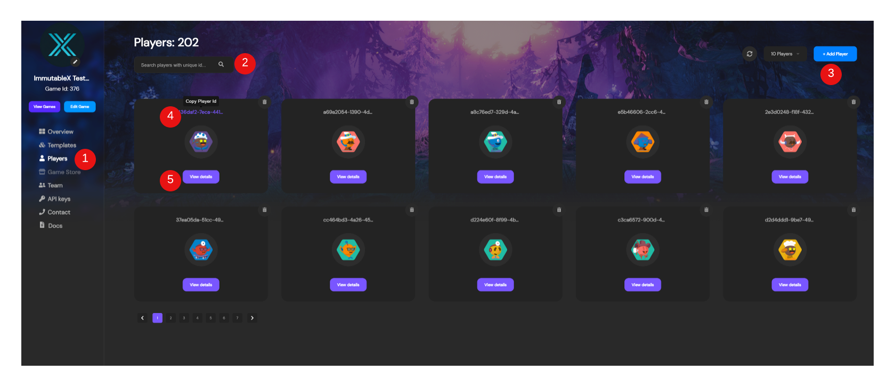
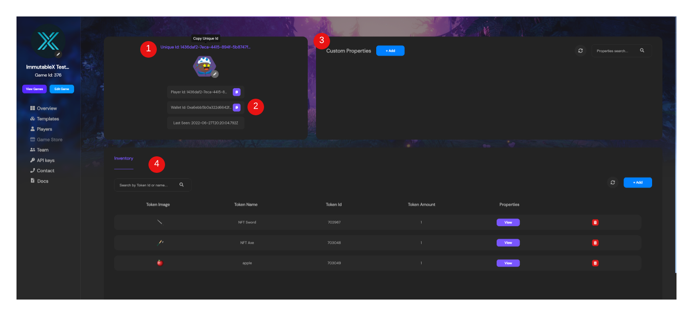

---

title: Managing Players
excerpt: Basics of how to use the Admin Dashboard to make and manage a players
category: ADMIN_DASHBOARD_ID
slug: managing-players
order: 3

---

In this guide we're going to go over the basics of managing players and making manual updates to players in the event you just need a simple ad-hoc fix so your player can get back into playing just as they were.

### The Players Page
The Players Page gives you a list of your current players with a registered account. 

1. **Player Nav** - With the left Nav bar being static wherever you, this Nav element allows you to switch views to start inspecting your players.
2. **Player Search** - If you have a player you're specifically looking for, here you can put in their uniqueId(email address, username, etc.) or their playerId to quickly locate a specific player
3. **Add Player** - If you want to manually add a player, you can do so with the `+ Add Player` button in the upper right hand corner. This creates a player with a local scope (see note below). 
4. **Quick Copy** - On Top of each Player Tile, there's the playerId in text. Clicking it, will copy it directly to your clipboard for use elsewhere
5. **Player Details** - Clicking the `View Details` button on a specific player allows you to view more details specifically just on that player

> 📘	Player ID Scope
> 
> When a player account is created it'll have either a local or global scope. With a local scope, that player account was just created for a specific game. With a global scope, which can only be created using the login widget, a player ID will be the same across all games.

### Player Details

1. **Quick Copy** - This quick copy is different from the one on the Players Page. This one copies the players _uniqueId_ instead of the playerId. This will be the player's email address, username, ID number, etc.
2. **Player Info** - This is additional information about the player, where you can also get playerId, their Wallet address, and when the player was last active. 
3. **Custom Properties** - These are developer defined properties. This allows you to manage additional info on top of the base information. For example if you want to add a player's XP or level, you could add it here by pressing the `+ Add` button. After you've added a custom property, you can update the value at anytime as well. And if you ever add so many, you can search for the property as well.
4. **Player Inventory** - This is where you can manage a specific player's inventory. If you want to mint a token to a player you can do that with the `+ Add` on the right-hand side. You can also search by tokens with the list, and view basic information about the token such as the name, id, and amount, but also any custom properties given to the token from either the template or at the time of mint. Lastly you can delete tokens from a player's inventory as well if ever a need be.
