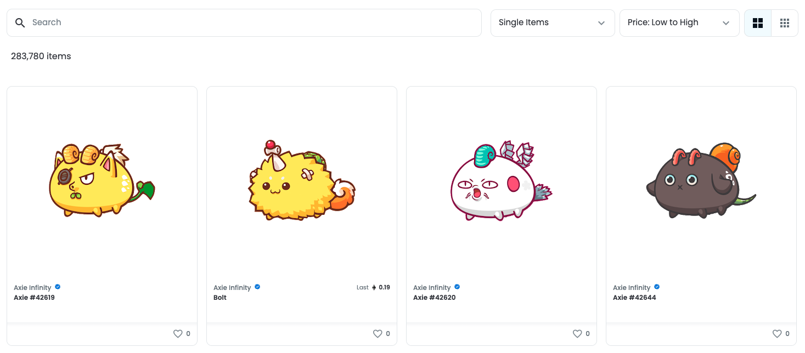

---

title: Creating an Orders Page
excerpt: Basics of how to create your own Order's Page
category: BUILDING_WITH_STARDUST_ID
parentDoc: MARKET_PARENT_ID
slug: making-a-orderpage
order: 2

---

Once a player clicks a game, order, or text searches - we need to show them the active orders for their items!



To search for orders based upon `gameId`, `templateId`, `playerId`, or text search (coming soon)
* Use this endpoint! https://stardust-marketplace.readme.io/reference/order-get-all

```javascript OpenOrders.js
const axios = require('axios');

const runner = async() {
  const url = "https://bddtm60cbd.execute-api.us-east-1.amazonaws.com/v1/order/get-all?status=offer";
  const openOrders = await axios.get(url);
  console.log(openOrders);
}

runner();
```