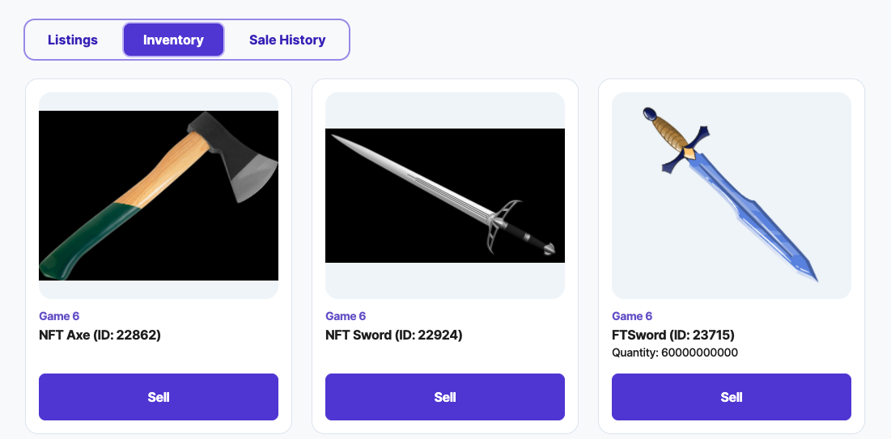

---

title: Creating a Player's Page
excerpt: Basics of how to create your own Players's Page
category: BUILDING_WITH_STARDUST_ID
parentDoc: MARKET_PARENT_ID
slug: making-a-userpage
order: 3

---

Few important things on the user page to build out
- Inventory
- Active Orders
- Order History



* Inventory
https://stardust-marketplace.readme.io/reference/inventory-get

```javascript inventory.js
const axios = require('axios');

const runner = async() {
 
}

runner();
```

* Active Orders
https://stardust-marketplace.readme.io/reference/order-get-all

```javascript activeOrders.js
const axios = require('axios');

const runner = async() {
  
}

runner();
```

* Order History
https://stardust-marketplace.readme.io/reference/order-get-all

```javascript orderHistory.js
const axios = require('axios');

const runner = async() {
  
}

runner();
```
