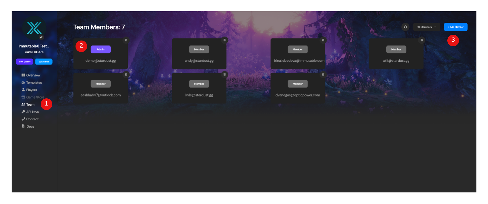
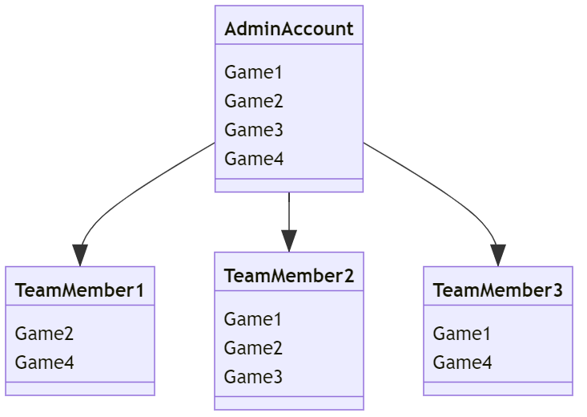

---

title: Working with Teams
excerpt: Basics of how to use teams within the Admin Dashboard to organize games across team members
category: ADMIN_DASHBOARD_ID
slug: working-with-teams
order: 4

---
Each game most likely has a team of designers, developer, and artists working together to help making it a reality. Well if that game is going to exist on the blockchain with Stardust then we understand the ability for different team members to have access to managing that game through the Stardust dashboard. Thus, why we added the teams page.

### Teams Page

1. **Team Nav Item** - With a game selected, here is a nav element to always switch views wherever you may be in the Stardust dashboard to view the team and team members.
2. **Team Member** - Each Team Member Tile let's you know the email of a given team member who has been added, their role (whether it be Admin or Member), and the option to remove them from the team.
3. **Add Member** - If you realize someone is missing from the team or there's someone you want to add to the team, you can do so by pressing the `+ Add Member` button in the upper right hand corner. This will bring up a prompt to let you enter the email of the team member you'd like to add, and the next time they log in, they will also be able to see the selected game!

### Best Practice: Managing Multiple Games

If you happen to be a studio that manages multiple games, or a publisher who's managing multiple games and also working with the studios who'll need access to their games, then you'' wanna structure you games and teams effectively to make for easy game management and team member access. To do this you'll want the following:

1. **Admin Account** - This is an account that Administrator(s) can have access to see all the games and manage them all from the same account
2. **Team Member Accounts** - These are accounts for the individual team members. They will be given access to their respective games via the Administrator.

