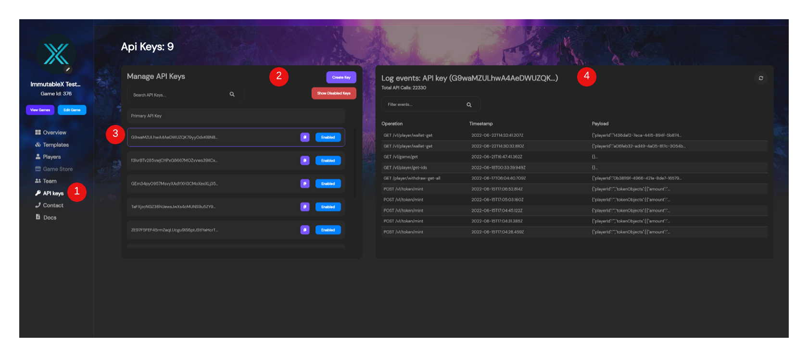

---

title: Using API Keys
excerpt: Basics of how to create and use API Keys within the Admin Dashboard
category: ADMIN_DASHBOARD_ID
slug: using-api-keys
order: 5

---

So you're ready to dive deeper and start building your own applications using stardust? Well then you're going to need an API key to do so!

### API Keys Page

1. **API Key's Nav Item** - This is the Nav item to jump directly to your API keys to either manage them or see their logs from anywhere in the dashboard.
2. **API Key Options** - You can create an API key with the `Create Key` button. Upon clicking it, it will automatically generate a new key for you. You can also change the view to see either you enabled or disable API keys by toggling the `Show Disabled Keys` button.
3. **Managing Individual Keys** - Clicking on a specific key in the list of API Keys will display it's logs on the right hand side in the log events. You can also copy the API key here as well as disable a specific API key.
4. **API Key Logs** - The Logs on the right hand side can let you know what activity is happening with a specific API key. You can click into the payload to see the full log payload for detailed inspecting

