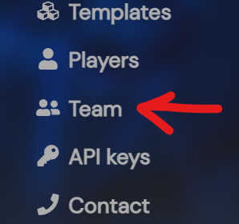
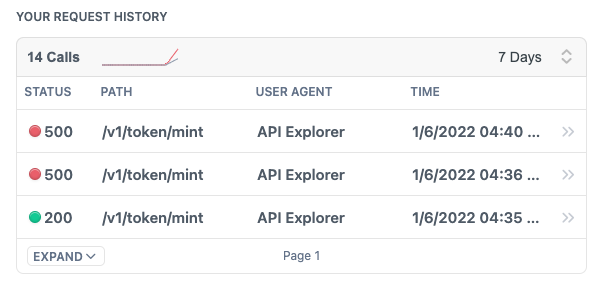

---

title: Working Together
excerpt: Basic Quick Start to effectively working with team members.
category: QUICK_START_ID
slug: working-together
order: 5

---

At this point, you've already been able to verify you can mint FTs and NFTs to players, so at this go ahead and invite your friends or coworkers and start making the next best blockchain game!

## Add Team Members

To add your team members, if you're looking at the admin dashboard, in the nav on the left is a `Team` element.

Go and and navigate there.

In the upper right hand corner theres a `+ Add Member` button. Click there and provide your team members email.

> 📘	Team Member Access
> 
> Stardust does not send an email or invite directly to your team member. Your Team member will need to register an account with Stardust using the entered email.

## Sharing API Data

We also encourage everyone to go back and tinker with each API endpoint and check out your request history to review your work.

If the's an history item you want to share, go ahead and in the top right, toggle that share button and copy a link to share with your team mates, boss, or cofounder to get their thoughts! That way they can play around with it too! 

